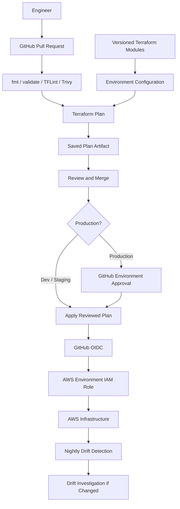

# Immutable AWS Infrastructure Platform

> An end-to-end platform engineering project demonstrating how secure, versioned and immutable AWS infrastructure can be designed, deployed and operated with Terraform and GitHub Actions.

<p align="center">
  
  
  
  
  
</p>

---

## Project Overview

This repository is the **portfolio view of a complete Terraform infrastructure project** built on AWS.

The original implementation deliberately used two repositories:

- `infra-modules` for reusable, versioned Terraform modules.
- `infra-live` for environment-specific configuration, remote state, CI/CD and deployment orchestration.

That separation is useful in a real engineering environment because reusable infrastructure code can evolve independently from the configurations that consume it. For portfolio review, however, jumping between two repositories makes the project harder to understand.

This repository therefore combines **snapshots of both layers into one place** so an employer can review the complete design from module implementation through to live environment deployment.

> **Important:** this is a showcase repository. The original `infra-modules` and `infra-live` repositories remain the authoritative engineering sources. CI/CD workflows are stored under `infra-live/.github/workflows/` in this repository so they are visible for review but do not execute from the repository root.

---

## What This Project Demonstrates

The project demonstrates practical experience with:

- Terraform module design and versioning
- AWS networking and multi-environment infrastructure
- Security baselines and preventative IAM guardrails
- Permission boundaries and least-privilege deployment roles
- GitHub OIDC authentication to AWS
- Remote Terraform state and state locking
- Immutable AMI creation
- Auto Scaling Groups and Application Load Balancers
- Amazon RDS PostgreSQL
- Secrets Manager and KMS integration
- Pull-request-based Terraform planning
- TFLint and Trivy security validation
- Immutable saved Terraform plans
- Production deployment approval
- Automated Terraform drift detection
- Cost budgets and anomaly detection
- Infrastructure validation and reachability testing

---

## Architecture



The central engineering principle is that **Terraform is the controlled write path**. Infrastructure changes are planned, reviewed and deployed through version-controlled code rather than changed manually in AWS.

---

## Repository Structure

```text
immutable-aws-infrastructure-terraform/
│
├── README.md
│
├── infra-modules/                  # Reusable Terraform module snapshot
│   ├── security-baseline/
│   ├── guardrails/
│   ├── iam-roles/
│   ├── vpc/
│   ├── ami-pipeline/
│   ├── compute-asg/
│   ├── rds/
│   ├── monitoring/
│   ├── budgets/
│   └── anomaly-detection/
│
└── infra-live/                     # Environment and pipeline snapshot
    ├── .github/
    │   └── workflows/
    ├── global/
    ├── dev/
    │   ├── vpc/
    │   ├── database/
    │   └── compute/
    ├── staging/
    │   └── vpc/
    ├── prod/
    │   └── vpc/
    └── PHASE7_EVIDENCE.md
```

The module directories retain their own focused README files where useful, but this root README is the **single project-level explanation**.

---

## Environment Design

| Scope | Deployed Infrastructure | Purpose |
| --- | --- | --- |
| Global | Security baseline, guardrails, IAM roles, monitoring and cost controls | Shared account-level governance |
| Development | VPC, golden AMI pipeline, ASG/ALB compute and PostgreSQL RDS | Full workload implementation and validation |
| Staging | VPC | Pre-production networking and pipeline validation |
| Production | VPC | Production networking and protected deployment workflow |

The project intentionally stops short of deploying staging and production compute/database workloads. The CI/CD and IAM pattern is established so those components can be added later without redesigning the platform.

---

## Terraform Module Layer

Reusable infrastructure components are kept under `infra-modules/`.

| Module | Responsibility |
| --- | --- |
| `security-baseline` | CloudTrail, AWS Config, GuardDuty, Security Hub, IAM Access Analyzer, encryption and account security defaults |
| `guardrails` | Preventative IAM controls, approved-region restrictions and protection of security services |
| `iam-roles` | Environment deployment roles, GitHub OIDC trust, permission boundaries and backend permissions |
| `vpc` | Multi-tier VPC networking, subnets, routing, NAT and flow logging |
| `ami-pipeline` | Immutable AMI build pipeline using AWS Image Builder |
| `compute-asg` | Launch templates, Auto Scaling Groups, ALB, target groups and security controls |
| `rds` | PostgreSQL RDS, DB subnet groups, encryption, backups, Secrets Manager and security groups |
| `monitoring` | CloudWatch-based monitoring resources |
| `budgets` | AWS budget controls |
| `anomaly-detection` | Cost anomaly monitoring |

### Versioning Strategy

The original module repository uses Git tags so live infrastructure references explicit module versions rather than `main`.

Example pattern:

```hcl
module "iam_roles" {
  source = "git::https://github.com/nabilislam30/infra-modules.git//iam-roles?ref=v1.8.13"
}
```

This makes infrastructure deployments reproducible and prevents an unreviewed module change from silently changing a live environment.

---

## Live Configuration Layer

The `infra-live/` directory represents the deployment layer.

Each environment owns its Terraform configuration and remote state key. Shared infrastructure is kept separately under `global/`.

Example state separation:

```text
global/terraform.tfstate

dev/vpc/terraform.tfstate
dev/database/terraform.tfstate
dev/compute/terraform.tfstate

staging/vpc/terraform.tfstate
prod/vpc/terraform.tfstate
```

Remote state is stored in S3 with locking provided by DynamoDB.

This separation limits blast radius and allows each component to be planned and deployed independently.

---

## Networking

The VPC module provides a reusable multi-tier network design with separate:

- Public subnets
- Private application subnets
- Database subnets
- Route tables
- Internet and NAT routing
- VPC Flow Logs

Development and staging use cost-conscious NAT designs, while the production VPC uses a per-AZ NAT strategy for stronger availability.

The database tier is private and is not directly reachable from the internet.

---

## Immutable Compute

The development compute layer follows an immutable infrastructure approach.

Instead of patching long-running instances in place:

```text
Source AMI
   ↓
AWS Image Builder
   ↓
Golden AMI
   ↓
Launch Template
   ↓
Auto Scaling Group
   ↓
Instance Replacement / Refresh
```

A new machine image results in a new infrastructure version rather than ad-hoc changes to an existing server.

The compute implementation includes:

- AWS Image Builder golden AMI pipeline
- EC2 Launch Template
- Auto Scaling Group
- Application Load Balancer
- Target Group and health checks
- Security groups
- Instance profile and IAM integration
- SSM-oriented access model

A restricted `/32` SSH path was retained in development specifically for the Phase 6 learning and reachability tests. The target operating model for higher environments is SSM rather than direct SSH.

---

## Database Layer

Development includes a private PostgreSQL RDS deployment with:

- Encryption using KMS
- Automated backups
- Deletion protection
- Database subnet group
- Security-group-to-security-group access
- Credentials stored in AWS Secrets Manager
- Environment-configurable Multi-AZ behaviour

The database is reachable from the application compute security group rather than being opened to broad CIDR ranges.

Connectivity was validated from the compute layer using PostgreSQL tooling, followed by a negative test from an unauthorised temporary security group to prove that the database security boundary denied access as expected.

---

## Security and Governance

Security controls are built into the platform rather than added after deployment.

### Account Security Baseline

The baseline includes AWS services such as:

- CloudTrail
- AWS Config
- GuardDuty
- Security Hub
- IAM Access Analyzer
- S3 account-level public access protection
- Default EBS encryption
- KMS-backed encryption where required

### Preventative Guardrails

IAM guardrails are used to restrict unsafe operations, including controls around:

- Unapproved AWS Regions
- Disabling core security services
- IAM user creation
- Environment separation
- Permission boundaries

Global IAM APIs are handled separately from regional service restrictions so the approved-region guardrail does not incorrectly block required IAM operations.

---

## GitHub OIDC and Deployment Identities

GitHub Actions authenticates to AWS using OIDC rather than stored long-lived AWS access keys.

Environment deployment identities include:

```text
tf-deploy-dev
tf-deploy-staging
tf-deploy-prod
```

Production planning uses a separate identity:

```text
tf-plan-prod
```

This allows a production pull request to refresh state and create a Terraform plan without granting the PR workflow the production write identity.

The production deployment role remains restricted to the `main` branch trust condition.

---

## CI/CD Pipeline

The final deployment workflow follows this model:

```text
Feature Branch
      ↓
Pull Request
      ↓
Terraform Format
Terraform Validate
TFLint
Trivy IaC Scan
      ↓
Terraform Plan
      ↓
PR Plan Summary
      ↓
Saved tfplan Artifact
      ↓
Review / Merge
      ↓
Retrieve Exact Reviewed Artifact
      ↓
Terraform Apply tfplan
```

The important design choice is that the apply workflow **does not create a new Terraform plan after merge**.

It retrieves the plan produced from the exact reviewed PR head commit and applies that saved artifact. This closes the gap between "what was reviewed" and "what was deployed".

### Pull Request Head Integrity

PR workflows explicitly check out the pull request head SHA rather than GitHub's synthetic merge ref. The saved artifact is therefore tied to the precise commit that produced the reviewed Terraform plan.

### Production Approval

Production adds an additional GitHub Environment approval stage:

```text
Reviewed Production Plan
          ↓
Merge to main
          ↓
Production Approval
          ↓
Apply Exact Reviewed Plan
```

The approval job is intentionally separated from the AWS-authenticated apply job. This preserves the production deployment role's branch-based OIDC trust while still enforcing an explicit deployment checkpoint.

---

## Validation and Security Scanning

Terraform changes are checked with:

```text
terraform fmt
terraform validate
TFLint
Trivy
terraform plan
```

Trivy is used as the repository-standard IaC security scanner.

During implementation, findings were addressed around encryption, logging, public-access protection, state resources and least-privilege permissions rather than simply relying on broad administrator access.

---

## Drift Detection

A scheduled GitHub Actions workflow checks Terraform state against AWS every night and can also be started manually.

The current drift matrix covers:

```text
dev-vpc
dev-database
dev-compute
staging-vpc
prod-vpc
```

Terraform runs with `-detailed-exitcode`:

| Exit Code | Meaning |
| --- | --- |
| `0` | No infrastructure drift |
| `1` | Terraform execution error |
| `2` | Drift detected |

If drift is detected, the workflow fails and retains the Terraform plan as an artifact for investigation. It does **not** automatically reconcile an unexpected change.

The final manual verification completed successfully across all five matrix jobs with no drift detected.

---

## Cost Awareness

Cost was considered as part of the design rather than ignored during development.

The module layer includes:

- AWS Budgets
- Cost anomaly detection
- Environment-specific NAT strategies
- Small development instance sizing
- Controlled creation of higher-cost infrastructure

Production networking demonstrates a more resilient per-AZ NAT pattern, while lower environments can use a lower-cost topology.

---

## Engineering Decisions

### Why Modules and Live Configuration Were Separate

The original two-repository architecture was intentional:

```text
infra-modules
    ↓ versioned releases
infra-live
    ↓
AWS
```

Benefits include independent module versioning, controlled promotion, clearer ownership and reduced risk of a module change unexpectedly affecting live configuration.

This portfolio repository combines the two **only for presentation**.

### Why Saved Terraform Plans Are Applied

Replanning after approval can produce a different plan from the one that was reviewed. Saving and applying the exact `tfplan` artifact creates a stronger relationship between review and deployment.

### Why OIDC Instead of Access Keys

OIDC removes the need to store static AWS credentials in GitHub. AWS trusts specific GitHub workflow identities and issues short-lived credentials when a workflow runs.

### Why Drift Is Reported Rather Than Automatically Fixed

Unexpected drift may represent an incident, emergency change or security problem. Automatically overwriting it could hide useful evidence. The workflow therefore detects and surfaces drift for investigation.

---

## Implementation Journey

The platform was built incrementally rather than as one large Terraform deployment.

```text
Foundation
   ↓
Security Baseline
   ↓
Guardrails and IAM
   ↓
Monitoring / Cost Controls
   ↓
VPC Networking
   ↓
Golden AMI
   ↓
Compute ASG + ALB
   ↓
PostgreSQL RDS
   ↓
Reachability Testing
   ↓
GitHub Actions CI/CD
   ↓
Production Approval
   ↓
Drift Detection
```

Several real implementation issues were encountered and resolved, including least-privilege IAM failures, security scanner findings, CI planning permissions, Application Load Balancer read permissions and Image Builder normalisation drift.

That troubleshooting process is an important part of the project: permissions were expanded only where evidence showed they were required rather than replacing the design with `AdministratorAccess`.

---

## How to Review This Repository

For a technical review, a useful path through the project is:

1. Start with this README for the architecture and engineering decisions.
2. Review `infra-modules/security-baseline/`, `guardrails/` and `iam-roles/` for the security model.
3. Review `infra-modules/vpc/`, `ami-pipeline/`, `compute-asg/` and `rds/` for reusable infrastructure implementation.
4. Review `infra-live/dev/` to see how modules are composed into an environment.
5. Review `infra-live/staging/vpc/` and `infra-live/prod/vpc/` for environment promotion patterns.
6. Review `infra-live/.github/workflows/` for PR planning, reviewed-plan deployment, OIDC, production approval and drift detection.
7. Review `infra-live/PHASE7_EVIDENCE.md` for final CI/CD verification evidence.

---

## Original Engineering Repositories

The authoritative source repositories remain available separately:

- [infra-modules](https://github.com/nabilislam30/infra-modules) — reusable versioned Terraform modules
- [infra-live](https://github.com/nabilislam30/infra-live) — environment-specific deployment configuration and GitHub Actions workflows

This combined repository is intentionally a **portfolio snapshot**, making the relationship between those two repositories easier to review.

---

## Current Scope and Future Extensions

The completed project provides a strong platform baseline, but there are deliberate areas that could be extended further:

- Add compute and database workloads to staging and production.
- Move all environment access to SSM-only and remove the development SSH learning path.
- Add Secrets Manager rotation configuration where required.
- Add a formal database migration mechanism for application schema changes.
- Integrate AWS IAM Identity Center when organisation-level prerequisites are available.
- Add stronger independent four-eyes production approval in a multi-user repository.

These are future platform enhancements rather than blockers to the completed implementation shown here.

---

## Project Outcome

The final result is a production-inspired AWS infrastructure platform where:

- infrastructure is defined as code,
- reusable components are versioned,
- environments are isolated,
- deployment identities use short-lived OIDC credentials,
- security controls are built into the design,
- pull requests produce reviewable Terraform plans,
- the exact reviewed plans are promoted into deployment,
- production includes an explicit approval checkpoint, and
- automated drift detection continuously checks that AWS still matches Terraform.

The project was designed to demonstrate not only how to create AWS resources with Terraform, but how to build the **engineering controls around Terraform that make infrastructure safer to operate**.
